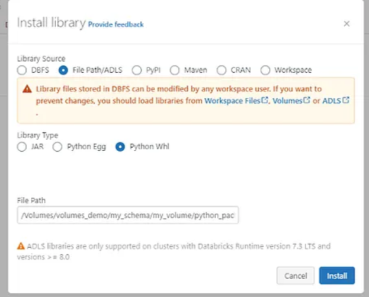
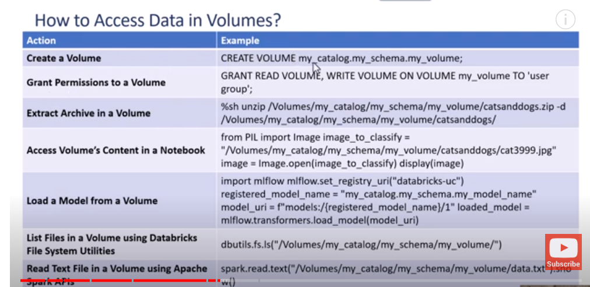

--You can use volumes to store and access files in any format, including structured, semi-structured, and unstructured data.
-- Only in Unity Catalog
--A volume can be managed or external
--A volume name is an identifier that can be qualified with a catalog and schema name in SQL commands.
--/Volumes/<catalog_identifier>/<schema_identifier>/<volume_identifier>/<path>/<file_name>
--SQL warehouse on SQL compute version 2023.35 or above or a cluster running Databricks Runtime 13.2 or above, unless you are using Azure Databricks UIs such as the Catalog Explorer
-- Can't create table in volumne path storage
--managed volumne: When you delete a managed volume, the files stored in this volume are also deleted from your cloud tenant within 30 days
--Unity Catalog does not manage the lifecycle or layout of the files in external volumes.

*** create volumes: 
CREATE EXTERNAL VOLUME <catalog>.<schema>.<external-volume-name>
LOCATION 'abfss://<container-name>@<storage-account>.dfs.core.windows.net/<path>/<directory>';

**** Permission: 

-- You must have owner privileges on a volume to manage volume privileges or drop volumes

    ** permission to read: 

    Volume >>	READ
    Schema >>	USE SCHEMA
    Catalog >>	USE CATALOG

    ** permission for opertiong on Volume

        * Move, create, or delete files on an external volume: 
            Volume >>	READ, WRITE
            Schema >>	USE SCHEMA
            Catalog >>	USE CATALOG

** drop volumes

DROP VOLUME IF EXISTS <volume-name>;

*** reserved paths for volumes
    - /Volumes
    - dbfs:/Volumes

    ---- Volumes are excluded from global search results in the Azure Databricks workspace
    -- %sh mv is not supported for moving files between volumes. Use dbutils.fs.mv or %sh cp instead.
    --- Uploaded files cannot exceed 5 gigabytes.

*** utrzymanie bibliotek w volumes zamiast na storagu: 

----In Databricks Runtime 13.2 and above, Databricks recommends using volumes to store .whl libraries for compute with assigned or shared access modes.
-----  In Databricks Runtime 13.3 and above, Databricks recommends using volumes to store JARs and init scripts for compute with assigned or shared access modes.

**** zalety uzywania: 

- Empower analysts to upload and work on adhoc files like csv, data, images...
- Load libraries from your storage
- Ingest files and images from external locations to Delta Lake tables
- Secure and track files access across different team
- Share local folders across your cluster for AI and Deep Learning
- Provide access control on top of files in your cloud storage (S3 bucket, ADLS, GCS).

***
---create volume with UC: 
    https://www.mssqltips.com/sqlservertip/7832/databricks-unity-catalog-volumes-step-by-step-guide/

*** Czemu jest lepsze niz DBFS:

With DBFS, anyone accessing the Databricks Workspace can read and write data on the mount point, making it a less recommended and riskier option than volumes.

**** instalacja biblioteki

**** fajny opis: 

https://medium.com/@roberto.ockerse/databricks-volumes-simplifying-data-storage-and-security-in-your-analytics-journey-792244cd1100

**** how to acccess to Volume: 
